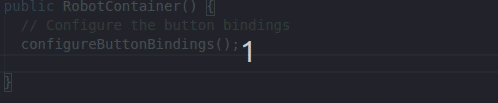

# THE SOURCE CODE HAS MOVED!! 
For the latest source code, go here: https://dev.azure.com/gabrielmcmillan/_git/limelight_library
The instructions below will still work however.

# limelight_library
A simple library to help make cleaner calls to the Limelight. 

# How to use:
1. In your build.gradle file paste the following:
This part goes before the deploy call.
<pre>
repositories {
   maven {
    url 'https://pkgs.dev.azure.com/gabrielmcmillan/limelight_library/_packaging/limelight_library_maven/maven/v1'
}
}
</pre>
This part goes under dependancies. Check the artifacts section for the latest version number.
<pre>
compile(group: 'com.fearxzombie', name: 'limelight_library', version: '0.7')
</pre>
2. Build your robot code to pull the dependancies.
3. In RobotContainer, instantiate limelight as a subsystem by using:
<pre>
public class RobotContainer {
  // Subsystems
  public static final limelight m_limelight = new limelight();
</pre>
Make sure you start the library before any depending subsystems/commands start. 
Not doing so will cause the robot code to go into a restart loop.

4. Use m_limelight.get**(); or m_limelight.set**(); to get or set NT values.

By default, the hostname used is "limelight", however it can be changed by appending a string to the contructor like so:
<pre>
public static final limelight m_limelight = new limelight("limelight-one");
</pre>

Also included is a document where most limelight networktables settings can be called in a more human readable way. Just call it like this:
<pre>
m_limelight.setLEDMode(ll_mode.led.on);
</pre>

# Legacy installation
In the event that the maven dependancy does not work, simply downloading the zip file from the Azure DevOps page and placing the src/main/java/com/fearxzombie
folder into the robot code directory will work the same way. However a pro with maven is that if any updates are pushed, one line change and build of code is all you need to be able
to implement new features.

This is an example robot project that uses the LimelightLibrary: https://dev.azure.com/gabrielmcmillan/limelight_library/_git/limelight_library_example
